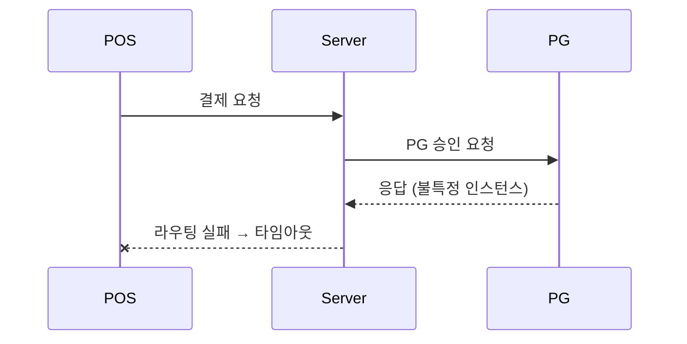
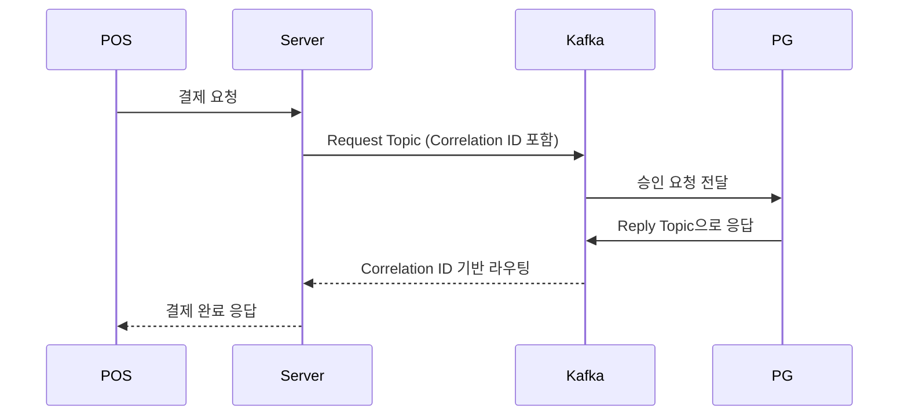
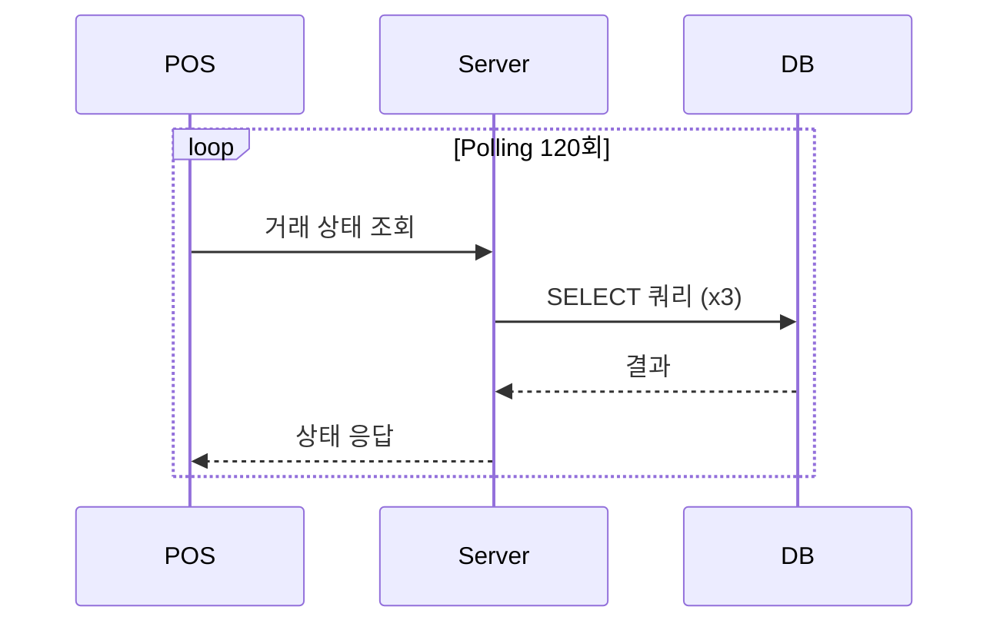
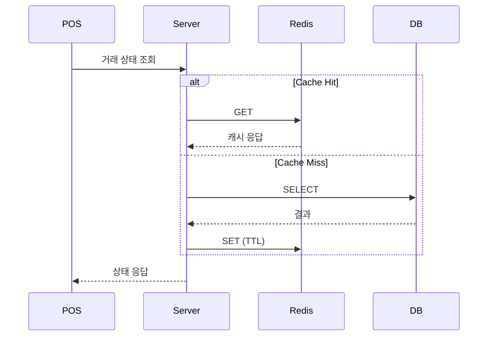
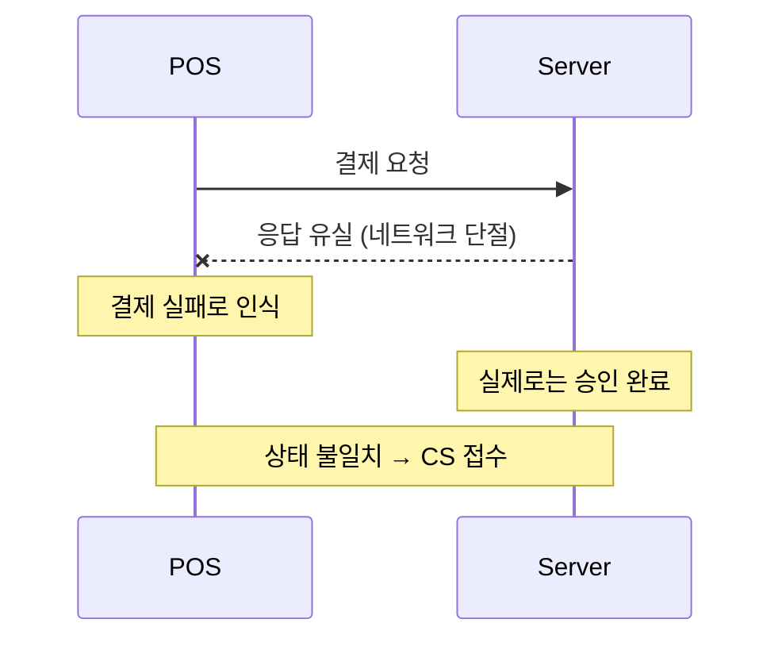
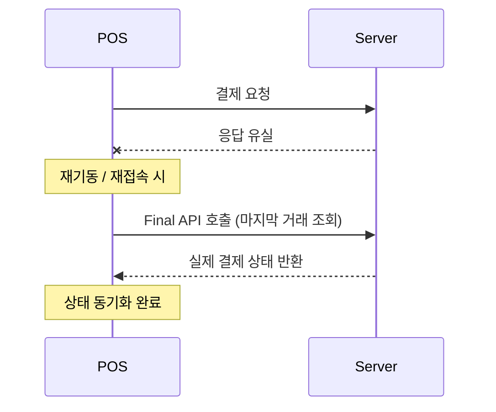
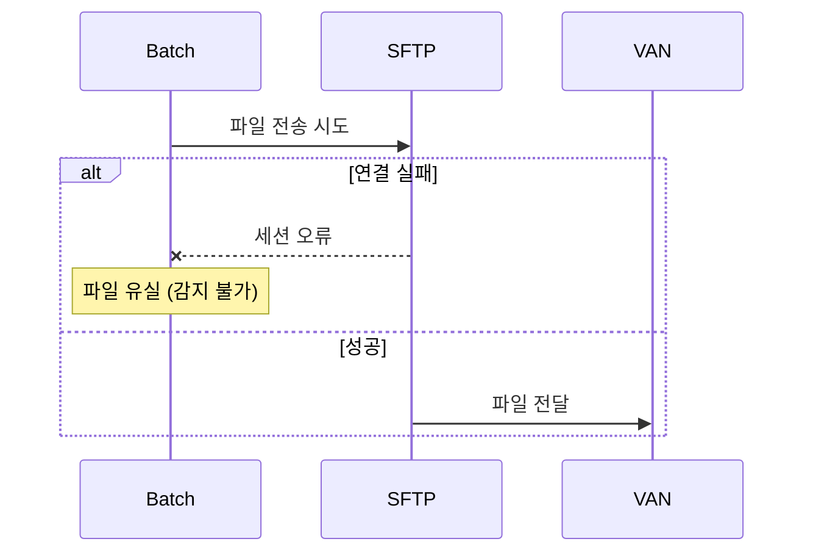
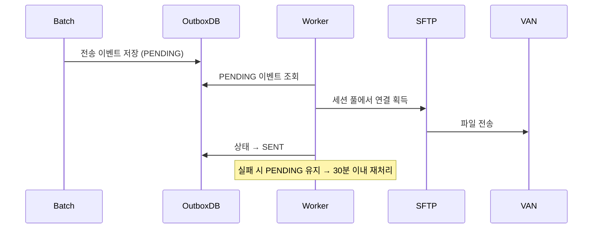

# 진현규 — 백엔드 개발자 포트폴리오

> Spring Boot / Kafka / Redis / MySQL / JPA · 핀테크 PG 도메인 3년차

---

## About

(주) 큐뱅에서 QR 결제 중계 플랫폼 백엔드 팀장으로 근무 중.
분산 결제 시스템의 안정성과 운영 효율을 높이는 작업에 집중해왔다.

📄 [이력서 PDF 링크] ← 추후 Figma PDF 링크 첨부

---

## 프로젝트

---

### 01. Kafka 통합 결제 아키텍처

**배경 & 문제 식별**

POS 단말 → 큐뱅 서버 → PG사로 이어지는 결제 흐름에서, 분산 환경의 Reply 라우팅 이슈로 타임아웃이 전체 결제 건의 50%에서 발생.
수동 CS 대응이 월 5건 이상 지속되었고, 운영자 개입 없이는 결제 완료 여부를 확인할 수 없는 구조였다.

**AS-IS 다이어그램**

**의사결정 근거 — 옵션 비교**

| 옵션 | 설명 | 장점 | 단점 |
|------|------|------|------|
| A. Polling | 서버가 주기적으로 PG 결과 조회 | 구현 단순 | DB 쿼리 폭증, 지연 발생 |
| B. WebSocket | 서버↔POS 상시 연결 유지 | 실시간 응답 | POS 단말 연결 관리 복잡 |
| **C. Kafka Request-Reply** | Reply Topic + Correlation ID로 라우팅 | 인스턴스 무관 응답 라우팅, 확장성 | 구현 복잡도 증가, Kafka 인프라 필요 |

→ C 선택. 분산 환경에서 특정 인스턴스에 종속되지 않는 Reply 라우팅이 핵심 요건이었기 때문.

**TO-BE 다이어그램**

**트러블슈팅**

- **문제**: 동일 Correlation ID가 복수 인스턴스에 수신됨
- **원인**: Consumer Group 설정 누락으로 브로드캐스트 발생
- **해결**: Reply Topic에 인스턴스별 단독 Consumer Group 할당

**결과 & 회고**

| 지표 | Before | After |
|------|--------|-------|
| 결제 타임아웃률 | 50% | **0%** |
| 수동 CS 건수 | 월 5건 | **월 2건 (60%↓)** |

인지된 한계: Kafka 브로커 장애 시 결제 전체 중단 리스크 → 향후 Circuit Breaker + 폴백 처리 고려.

---

### 02. 거래 상태 조회 Redis 개선

**배경 & 문제 식별**

결제 완료 후 POS가 거래 상태를 Polling 방식으로 조회하는 구조.
Polling 1회당 DB 쿼리 3회 발생, 120회 Polling 기준 360회 쿼리가 DB에 집중.
응답시간 평균 200ms, 피크 타임 DB 부하 과다.

**AS-IS 다이어그램**

**의사결정 근거 — 옵션 비교**

| 옵션 | 설명 | 장점 | 단점 |
|------|------|------|------|
| A. DB 인덱스 최적화 | 쿼리 튜닝 | 추가 인프라 불필요 | 쿼리 수 감소 없음 |
| B. Read Replica | DB 읽기 분리 | 마스터 부하 감소 | 인프라 비용 증가 |
| **C. Redis Cache-Aside** | 조회 결과 캐싱 + 트랜잭션 경계 최적화 | DB 쿼리 0회 가능, 응답 속도 대폭 향상 | 캐시 정합성 관리 필요 |

→ C 선택. 거래 상태는 최종 확정 후 변경 없음 → 캐시 무효화 시점이 명확해 정합성 리스크 낮음.

**TO-BE 다이어그램**

**트러블슈팅**

- **문제**: 결제 완료 직후 캐시 미반영으로 구 상태 응답
- **원인**: DB 트랜잭션 커밋 전 캐시 저장 시도
- **해결**: 트랜잭션 커밋 후 이벤트 기반 캐시 저장으로 순서 보장

**결과 & 회고**

| 지표 | Before | After |
|------|--------|-------|
| DB 쿼리 수 (Polling 120회) | 360회 | **0회** |
| 응답시간 | 200ms | **30ms (85%↓)** |

인지된 한계: Redis 장애 시 전량 DB 직접 조회로 폴백 → 장애 격리 전략 별도 수립 필요.

---

### 03. CS 95% 감소 Final API

**배경 & 문제 식별**

POS 단말과 큐뱅 서버 간 결제 상태 불일치 발생.
네트워크 단절, 응답 유실 등으로 POS는 "실패"로 인식하나 실제로는 "승인 완료"인 케이스가 월 10건 이상 발생.
운영팀이 매번 DB 직접 조회 후 수기 처리.

**AS-IS 다이어그램**

**의사결정 근거 — 옵션 비교**

| 옵션 | 설명 | 장점 | 단점 |
|------|------|------|------|
| A. 재시도 로직 | 클라이언트 재시도 | 구현 단순 | 중복 결제 위험 |
| B. 멱등성 키 | 요청 중복 방지 | 중복 방지 | 상태 불일치 미해결 |
| **C. Final API 패턴** | 마지막 결제 건 조회 API로 상태 동기화 | 상태 불일치 자동 해소, CS 없이 POS가 자가 복구 | POS 클라이언트 수정 필요 |

→ C 선택. 근본 원인(상태 불일치)을 POS가 자율적으로 해소하게 함으로써 운영팀 개입을 구조적으로 제거.

**TO-BE 다이어그램**

**트러블슈팅**

- **문제**: Final API 호출 시점에 트랜잭션 미완료 건 포함
- **원인**: 승인 처리 중인 건도 조회 대상에 포함
- **해결**: 상태값 필터링으로 "최종 확정" 건만 반환하도록 수정

**결과 & 회고**

| 지표 | Before | After |
|------|--------|-------|
| 상태 불일치 CS | 월 10건 | **월 0~1건 (95%↓)** |
| 수동 처리 공수 | 연 40시간 | **0시간** |

인지된 한계: POS 펌웨어 버전에 따라 Final API 미지원 단말 존재 → 버전별 분기 처리 추가 필요.

---

### 04. Outbox 패턴 파일유실 0%

**배경 & 문제 식별**

결제 정산 데이터를 SFTP로 VAN사에 전송하는 배치 구조.
SFTP 세션 연결 실패 또는 배치 중단 시 파일이 유실되고, 감지까지 불특정 시간 소요.
CS 월 3건 이상, 유실 인지 후 수동 재전송.

**AS-IS 다이어그램**

**의사결정 근거 — 옵션 비교**

| 옵션 | 설명 | 장점 | 단점 |
|------|------|------|------|
| A. 재시도 로직 | 실패 시 즉시 재시도 | 구현 단순 | 세션 풀 고갈 시 무한 실패 |
| B. Dead Letter Queue | 실패 건 별도 큐 보관 | 유실 방지 | 추가 인프라 필요 |
| **C. Outbox 패턴 + SFTP 세션 풀링** | DB에 전송 이벤트 저장 후 별도 프로세스 처리 | 유실 원천 차단, 세션 안정성 확보 | 구현 복잡도 증가 |

→ C 선택. 파일 유실의 근본 원인인 "원자성 부재"를 DB Outbox로 해결하고, 세션 풀링으로 연결 안정성 확보.

**TO-BE 다이어그램**

**트러블슈팅**

- **문제**: 동일 파일 중복 전송 발생
- **원인**: Worker 중복 실행 시 PENDING 상태 다수 조회
- **해결**: Optimistic Lock + 상태 CAS 업데이트로 단일 처리 보장

**결과 & 회고**

| 지표 | Before | After |
|------|--------|-------|
| 파일 유실률 | 100% (발생 시) | **0%** |
| 장애 감지 시간 | 불특정 | **30분 이내 자동 감지** |
| CS 건수 | 월 3건 | **월 0건** |

인지된 한계: Outbox Worker 단일 인스턴스 → 향후 분산 락(Redisson) 기반 다중 Worker 전환 고려.

---

## 오픈소스

### es-hangul Java 포팅

> 토스 자사 오픈소스 [es-hangul](https://github.com/toss/es-hangul)의 Java 포팅 프로젝트.
> Maven Central 배포 완료, 사내 결제 시스템에 직접 적용.

- 기능 추가 완료 후 상세 내용 작성 예정
- 포팅 동기 / 기능 목록 / 사내 적용 사례 포함 예정
